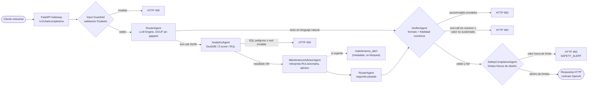
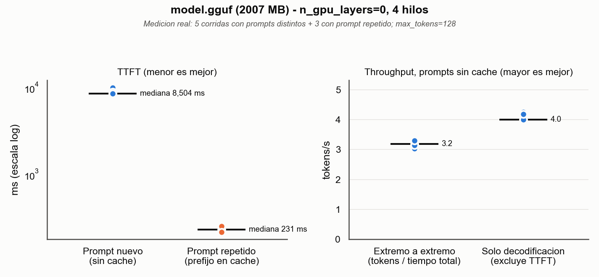

# SLM Industrial Gateway

Gateway HTTP compatible con OpenAI para un modelo de lenguaje pequeño (SLM)
adaptado por dominio a jerga industrial y minera, con ejecución de
herramientas analíticas (DuckDB, detección de anomalías, cálculo de RUL) y
guardrails de seguridad. Diseñado para desplegarse on-prem, sin dependencia
de red para la ruta de inferencia.

## Arquitectura

El sistema se compone de seis módulos independientes bajo `src/`, integrados
por la capa de API a través de un pipeline multi-agente:

```
              ┌────────────────────────────────────┐
              │           src/api (FastAPI)          │
              │  /v1/chat/completions                 │
              │  /v1/pdm/diagnose                     │
              │  /v1/models  /health  /metrics        │
              └──────────────────┬────────────────────┘
                                 │ delega en
              ┌──────────────────▼─────────────────────┐
              │      src/agents (AgentOrchestrator)      │
              │  RouterAgent -> AnalyticsAgent            │
              │  (+MaintenanceAdvisorAgent, advisor)       │
              │  -> VerifierAgent -> SafetyComplianceAgent │
              │  (bloqueante)                              │
              │                                            │
              │  PdMAgent: registrado aparte, expuesto      │
              │  vía diagnose_asset() -- no entra en el     │
              │  camino de chat de arriba                   │
              └────┬──────────────┬──────────────┬────────┘
                   ▼               ▼               ▼
         ┌────────────────┐ ┌───────────────┐ ┌───────────────────┐
         │   src/engine     │ │  src/tools     │ │  src/guardrails    │
         │   LLMServer       │ │  ToolRegistry  │ │  validate_sql_      │
         │   (llama.cpp,      │ │  + industrial  │ │  query,              │
         │   GGUF, fallback    │ │  _tools        │ │  validate_json_       │
         │   GPU→CPU)           │ │  (DuckDB,      │ │  output                │
         └──────────────────────┘ │  Z-score, RUL) │ └────────────────────────┘
                                   └────────────────┘

        src/evaluation (offline, no se ejecuta en el request path)
        FaithfulnessEvaluator (DeepEval, LLM juez externo) para evaluación
        batch — distinto del chequeo de fidelidad local y sin red que hace
        VerifierAgent en cada solicitud (ver "Flujo de datos" más abajo).

        src/training (offline, no se ejecuta en el gateway)
        QLoRA (Unsloth + TRL SFTTrainer) sobre data/domain_dataset/
        → produce adaptadores LoRA que se cargan como el modelo GGUF
          cuantizado que consume src/engine.
```

`src/tools` depende de `src/guardrails` (todo query SQL y todo argumento de
tool pasa por un validador antes de ejecutarse). `src/agents` depende de los
tres módulos de runtime (`engine`, `tools`, `guardrails`) y es el único punto
de entrada que usa `src/api` para procesar una conversación: la API ya no
arma el prompt ni despacha tools directamente, delega todo el flujo a
`AgentOrchestrator`. `src/evaluation` y `src/training` son pipelines offline,
desacoplados del servicio HTTP.

### Flujo de datos de `/v1/chat/completions`



1. **Validación de entrada**: Pydantic valida el payload (`ChatCompletionRequest`);
   se rechaza con `400` si `messages` está vacío o no cumple el esquema.
   `src/api` traduce los `ChatMessage` del contrato HTTP a `AgentMessage`
   internos y delega en `AgentOrchestrator.run()` (`src/agents`). Antes de
   tocar el modelo, el orquestador pasa el último mensaje del usuario por
   `RouterAgent.check_threat()` (`detect_threat`): patrones deterministas de
   inyección de prompt, SQL o comandos se rechazan con `400` sin costo de red
   ni de inferencia. `RouterAgent.classify_intent()` (clasificación
   ANALYTICS_REQUIRED/DIRECT_QA con una llamada barata al SLM) existe y está
   probado (`tests/test_router_agent.py`) pero todavía no se invoca en este
   camino caliente — ver el docstring de `src/agents/orchestrator.py`.
2. **RouterAgent**: construye un prompt que incluye el listado de tools
   disponibles (`ToolRegistry.list_tools()`) y las instrucciones de formato de
   tool call, e invoca `LLMServer.generate()` (`src/engine`, backend
   llama.cpp sobre el modelo GGUF local). La respuesta se intenta parsear
   como `{"tool": "<nombre>", "arguments": {...}}`; si no es JSON válido para
   ese esquema, se trata como respuesta final en lenguaje natural y se salta
   al paso 4.
3. **AnalyticsAgent (si el RouterAgent pidió una tool)**: despacha la llamada
   vía `ToolRegistry.dispatch()` (`src/tools`), que valida los argumentos
   contra el `args_schema` de la tool y —para `query_duckdb`— además contra
   `validate_sql_query` (`src/guardrails`): solo se permiten
   `SELECT/WITH/EXPLAIN/DESCRIBE/SHOW`, una única sentencia, sin palabras
   clave destructivas. Si la tool fue `calculate_rul` o `sensor_anomaly_check`,
   `MaintenanceAdvisorAgent.assess()` (`src/agents/maintenance_advisor.py`)
   interpreta el resultado crudo contra un umbral de urgencia fijo (RUL ≤ 24h,
   o ≥ 2 lecturas anómalas) y, si corresponde, adjunta `maintenance_alert` al resultado
   final — **advisor, no bloqueante**: un RUL bajo es información operativa
   para planificar mantenimiento, no una condición insegura que deba impedir
   la respuesta. El resultado de la tool se inyecta como un mensaje de rol
   `tool` y se vuelve a invocar al `RouterAgent` para que redacte la
   respuesta final con ese contexto (un único hop: si el SLM pide otra tool
   en esta segunda pasada, el `VerifierAgent` la rechaza en el paso 4 en vez
   de encadenar).
4. **VerifierAgent**: antes de responder, rechaza (`500`, `GenerationError`)
   una respuesta final vacía o de tipo inválido —una falla del modelo, no de
   contenido—; rechaza (`400`) una respuesta final que en realidad es un
   tool-call sin resolver; y rechaza (`400`, `FaithfulnessError`) una
   respuesta que menciona valores numéricos que no aparecen en el resultado
   crudo de la tool ejecutada. Este último chequeo es una heurística local
   (comparación de números, sin LLM juez ni red) — un filtro barato en el
   camino caliente, no un reemplazo del `FaithfulnessMetric` de DeepEval
   (`src/evaluation`), que sigue siendo la evaluación de referencia pero solo
   corre offline/batch. Cualquier otro error de guardrail o de ejecución de
   tool (SQL peligroso, tool desconocida, argumentos inválidos) también se
   traduce a `400`.
5. **SafetyComplianceAgent**: la última puerta, después de que `VerifierAgent`
   ya aprobó el texto final. Audita cada valor numérico con unidad
   (potencia MW, presión PSI, temperatura °C) mencionado en la respuesta
   contra una matriz FIJA de límites de diseño físico del sitio
   (`OPERATIONAL_LIMITS`, `src/agents/safety_agent.py`) — inmutable en
   runtime, sin variable de entorno que la relaje. Si algún valor supera su
   límite, lanza `SafetyAlertError` (`SAFETY_ALERT`) y la respuesta **nunca**
   llega al cliente, ni siquiera parcialmente; `src/api` lo traduce a `400`
   igual que el resto de los `GuardrailError`.
6. **Respuesta JSON**: se devuelve un `ChatCompletionResponse` con el mismo
   contrato que la API de OpenAI, y se registran métricas de Prometheus
   (tokens generados, latencia por token, resultado de la solicitud).

Todas las tools están protegidas por guardrails; ninguna tool ejecuta SQL de
escritura ni comandos del sistema.

### `PdMAgent` y `/v1/pdm/diagnose` (fuera del flujo de chat)

`PdMAgent` (`src/agents/pdm_agent.py`) es una capacidad aparte, no un paso de
`AgentOrchestrator.run()`: diagnostica un activo a partir de una o más series
de condición (vibración, temperatura, carga) que el cliente ya tiene —
llamando `calculate_rul` una vez por métrica, clasificando cada una como
`healthy`/`degrading`/`critical`/`insufficient_data` según umbrales de RUL, y
agregando el diagnóstico del activo completo (la métrica más urgente gana,
con una confianza que baja con lecturas fuera de rango físicamente plausible).
Degrada con gracia: una métrica con datos insuficientes no aborta el
diagnóstico de las demás. `AgentOrchestrator.diagnose_asset(asset_id, series)`
lo expone al resto del código, y `src/api/routes.py` lo sirve en
`POST /v1/pdm/diagnose` — sin pasar por `get_llm_server()` (`PdMAgent` nunca
invoca al SLM), así que el endpoint funciona aunque no haya ningún modelo GGUF
cargado.

No confundir con `MaintenanceAdvisorAgent` (§ paso 3 arriba): ese vive dentro
del pipeline de chat e interpreta un resultado que *ya* calculó
`AnalyticsAgent` a pedido del SLM; `PdMAgent` es un diagnóstico explícito,
multi-métrica, pedido directamente por un cliente (un sistema SCADA/historian,
por ejemplo) que no pasa por ninguna conversación.

## Benchmarks

### Motor de inferencia (medición real)

```bash
python -m src.engine.benchmarks --model-path data/models/model.gguf
python scripts/generate_plots.py   # dibuja gguf_benchmark.png desde el JSON
```

El primer comando corre el protocolo de `src.engine.benchmarks.run_suite` —
una corrida de calentamiento descartada, luego 5 corridas con prompts
distintos (limpiando el estado de llama.cpp antes de cada una, para que el
TTFT incluya la evaluación completa del prompt), más un control de 3 corridas
con el mismo prompt repetido *sin* limpiar (mide el TTFT con el prefijo ya en
caché) — y guarda cada corrida en `outputs/reports/gguf_benchmark.json`, de
donde salen la tabla y el gráfico de abajo. Modelo medido: **Qwen2.5-3B-Instruct,
cuantización Q4_K_M (2,0 GB)**, en una laptop **AMD Ryzen 5 2500U (4 núcleos /
8 hilos, 7 GB de RAM), solo CPU** (`n_gpu_layers=0`, 4 hilos, `n_ctx=4096`),
llama-cpp-python 0.3.2 (wheel CPU) -- este equipo no tiene GPU dedicada, así
que no hay ninguna cifra de GPU en esta sección, medida ni estimada.



| Métrica | Mediana | Rango (5 corridas) |
|---------|--------:|--------------------:|
| TTFT, prompt nuevo (ms) | 8 504 | 8 155 – 9 945 |
| Throughput extremo a extremo (tok/s) | 3,2 | 3,0 – 3,3 |
| Throughput solo decodificación (tok/s) | 4,0 | 3,9 – 4,3 |
| RAM residente del proceso (MB) | 1 902 | 1 901 – 1 903 |
| VRAM (MB) | n/a (sin GPU NVIDIA) | — |

**Cómo leer los números.**

- *TTFT y caché de prefijo.* llama-cpp-python reutiliza el prefijo común con
  el prompt anterior. Como control, repetir el mismo prompt sin `reset()` da
  un TTFT mediano de **231 ms** (3 corridas, 215–251 ms), unas 37 veces menos:
  no es el costo de un prompt nuevo, sino el de un caché caliente. El número
  de la tabla es el caso sin caché.
- *Throughput.* `run_benchmark` divide los tokens por el tiempo total, que
  incluye el TTFT; la fila "solo decodificación" excluye ese tiempo. Con
  respuestas cortas y un prompt lento, la diferencia entre ambas es grande.
- *RAM.* El modelo se mapea con `mmap`: tras cargarlo, el proceso ocupaba
  234 MB, y sube a ~1,9 GB a medida que la inferencia toca los pesos.
- *Variación entre sesiones.* Una sesión anterior en la misma máquina, con el
  mismo protocolo y prompts casi iguales, dio TTFT 7 891 ms, 2,9 tok/s
  extremo a extremo y 3,5 tok/s de decodificación: diferencias de 8–15 %,
  mayores que el rango dentro de cada sesión. Leer los números con esa
  precisión, no con la de la tabla.

**Limitaciones.** Una sola cuantización y un solo modelo (3B, no 7B): no hay
todavía una comparación FP16 / Q8_0 / Q4_K_M medida (`quant_benchmark.png`
sigue siendo el placeholder ilustrativo de siempre, ver abajo). El hardware es
una laptop con memoria justa (≈2,5 GB libres y swap en uso), así que estos
números son un piso, no el rendimiento esperable en el hardware de destino.
La versión de llama-cpp-python medida (0.3.2) no es la fijada en
`requirements.txt` (0.3.4), porque no hay wheel precompilado de 0.3.4 para
Python 3.10 en Windows. Sin intervalo de confianza: 5 corridas. El JSON
completo (todas las corridas, cruda) queda versionado en
[`outputs/reports/gguf_benchmark.json`](outputs/reports/gguf_benchmark.json)
para que cualquiera pueda verificar los números exactos sin volver a correr
el benchmark.

`quant_benchmark.png` sigue mostrando los valores **ilustrativos** de
`scripts/generate_plots.py` (FP16/Q8_0/Q4_K_M para 7B), que no son una
medición y no deben citarse como tal:


### Evaluación del agente (ilustrativa)

> **Los números de esta subsección son ilustrativos, no una medición real.**
> Correr `src/evaluation.FaithfulnessEvaluator` de verdad requiere un modelo
> juez externo (por defecto `gpt-4o-mini` vía API) — no es un límite de
> CPU/GPU sino de credenciales de red, fuera del alcance de este benchmark.
> Reemplazar estos valores exige correr el evaluador aparte sobre un set de
> prueba real, más las tasas de SQL Safety / JSON Validity de
> `src.guardrails` sobre intentos de dispatch de tools registrados.


| Métrica            | Valor | Qué mide |
|---------------------|------:|----------|
| Faithfulness         | 0.93  | El `FaithfulnessMetric` de DeepEval: cuánto de la respuesta está sustentado por el contexto recuperado. |
| Answer Relevancy     | 0.89  | Qué tan pertinente es la respuesta final respecto a la pregunta del usuario. |
| SQL Safety Rate      | 1.00  | Fracción de intentos de `query_duckdb` con SQL peligroso correctamente bloqueados por `validate_sql_query`. |
| JSON Validity        | 0.97  | Fracción de tool calls emitidas por el SLM que parsean como `ToolCallEnvelope` sin error de esquema. |

`python scripts/generate_plots.py` regenera los tres gráficos:
`gguf_benchmark.png` desde el JSON medido (se omite si el JSON no existe, sin
inventar valores) y los dos ilustrativos desde los valores fijos del script.

## Estructura del repositorio

```
src/
  engine/       LLMServer (GGUF/llama.cpp), benchmarks (CLI real: run_suite,
                cold/cached TTFT, throughput extremo-a-extremo/decodificación)
  api/          Gateway FastAPI, contrato OpenAI + /v1/pdm/diagnose, métricas
                Prometheus
  agents/       Pipeline de chat: RouterAgent -> AnalyticsAgent (si aplica,
                con evaluación MaintenanceAdvisorAgent advisor) ->
                VerifierAgent (fidelidad numérica + formato) ->
                SafetyComplianceAgent (límites físicos, bloqueante) -- todos
                locales y sin red en cada solicitud. PdMAgent aparte:
                diagnóstico multi-métrica, expuesto vía diagnose_asset()
                y /v1/pdm/diagnose, no entra en ese pipeline
  tools/        ToolRegistry, herramientas industriales (query_duckdb,
                sensor_anomaly_check, calculate_rul)
  guardrails/   Validación de SQL y de salidas JSON estrictas
  evaluation/   Evaluador de fidelidad/alucinación (DeepEval, offline)
  training/     Pipeline QLoRA (dataset_prep.py, finetune.py)
data/
  domain_dataset/  Dataset sintético ChatML de dominio (telemetría/sensores)
  models/          Pesos GGUF locales (no versionado; ver instalación)
scripts/
  quantize.py             Verifica/carga modelos GGUF cuantizados (Q4_K_M, Q8_0)
  generate_plots.py       Genera los gráficos de `outputs/reports/` (ver Benchmarks)
  verify_finetuning_pipeline.py  Valida el pipeline QLoRA de punta a punta sin
                          GPU (dataset, config, intento de carga del modelo
                          base) y guarda el estado real en finetuning_metrics.json
outputs/
  reports/        Gráficos versionados que embeben el README (PNG), más
                   gguf_benchmark.json (última corrida real de CPU) y
                   finetuning_metrics.json (estado verificado del pipeline QLoRA)
monitoring/
  prometheus.yml  Configuración de scraping para el contenedor Prometheus
tests/
  test_engine.py, test_api.py, test_agents.py, test_router_agent.py,
  test_analytics_agent.py, test_maintenance_advisor.py, test_pdm_agent.py,
  test_safety_agent.py, test_tools.py, test_guardrails.py, test_eval.py,
  test_training.py, test_integration.py (ver `pytest -v` para el listado
  completo y vigente)
```

## Guía de despliegue air-gapped

El servicio de inferencia (`src/engine` + `src/api`) no requiere red en
tiempo de ejecución: el modelo GGUF es un archivo local y llama.cpp corre
in-process. Los únicos puntos que sí asumen red por defecto son (a) la
instalación de dependencias Python y (b) el módulo de evaluación si se deja
apuntando a un juez alojado en la nube. Para un entorno sin salida a
Internet:

### 1. Dependencias Python (wheelhouse)

En una máquina con red (misma versión de Python/plataforma que el destino):

```bash
pip download -r requirements.txt -d wheelhouse/
```

Copiar `wheelhouse/` y `requirements.txt` al entorno aislado, e instalar ahí
sin acceso a PyPI:

```bash
pip install --no-index --find-links=wheelhouse/ -r requirements.txt
```

### 2. Montaje local de los pesos GGUF

El modelo nunca se descarga en tiempo de ejecución: `MODEL_PATH` apunta a un
archivo `.gguf` que ya tiene que estar en disco.

1. Copiar el archivo a `data/models/model.gguf` (o la ruta que indique
   `MODEL_PATH`); en Docker Compose esa carpeta se monta como volumen
   de solo lectura (`./data/models:/app/data/models:ro`), así que el `.gguf`
   nunca se copia dentro de la imagen ni queda expuesto por accidente.
2. Verificar el archivo (cabecera GGUF válida y cuantización detectada) y
   opcionalmente cargarlo en memoria para confirmar que arranca:

   ```bash
   python scripts/quantize.py data/models/model.gguf --load
   ```

### 3. Arranque offline vía Docker Compose

En la máquina con red, pre-cargar las imágenes base (no hay Dockerfile para
Prometheus: se usa la imagen oficial tal cual):

```bash
docker pull python:3.11-slim
docker pull prom/prometheus:v3.0.1
docker save python:3.11-slim prom/prometheus:v3.0.1 -o base-images.tar
```

En el destino aislado:

```bash
docker load -i base-images.tar
docker compose build   # usa solo wheelhouse/ y las imagenes ya cargadas, sin red
docker compose up -d
```

`docker compose build` no debe disparar ningún acceso a red si el
`Dockerfile` y `requirements.txt` están fijados a wheels ya presentes en
`wheelhouse/`; si el build intenta salir a Internet, es señal de una
dependencia sin pin exacto en `requirements.txt`.

### 4. Configuración de guardrails

Los guardrails (`src/guardrails/validators.py`) son intencionalmente
**código, no configuración**: la lista de verbos SQL permitidos
(`ALLOWED_SQL_VERBS`) y de palabras clave bloqueadas (`BLOCKED_SQL_KEYWORDS`)
son constantes fijas, sin variable de entorno ni flag que las relaje en
producción. Esto es deliberado en un entorno air-gapped: no hay superficie de
configuración en runtime que un operador pueda aflojar por error (o que un
prompt del propio SLM pueda intentar manipular). Para ampliar qué puede hacer
el agente, la vía soportada es agregar una tool nueva y explícita en
`src/tools/industrial_tools.py`, no relajar el validador SQL existente.

### 5. Evaluación offline sin salida a Internet

`src/evaluation` usa DeepEval con un modelo juez configurable
(`FaithfulnessEvaluator(judge_model=...)`). Por defecto apunta a
`gpt-4o-mini` (API externa). En un entorno aislado, apuntar
`OPENAI_BASE_URL`/`OPENAI_API_KEY` a un endpoint OpenAI-compatible servido
localmente (por ejemplo, este mismo gateway u otro servidor local), o
simplemente omitir la evaluación de fidelidad en producción: en CI,
`tests/test_eval.py` corre con las métricas de DeepEval mockeadas, sin red.

## Configuración (variables de entorno)

| Variable              | Default                          | Usado por         |
|-----------------------|-----------------------------------|-------------------|
| `MODEL_NAME`          | `local-slm`                       | `src/api` (metadata de `/v1/models`) |
| `MODEL_PATH`          | `data/models/model.gguf`          | `src/api` → `src/engine.LLMServer` |
| `MODEL_N_CTX`         | `4096`                            | `src/engine.LLMServer` (ventana de contexto) |
| `DEEPEVAL_JUDGE_MODEL`| `gpt-4o-mini`                      | `src/evaluation.FaithfulnessEvaluator` |
| `OPENAI_API_KEY`      | (vacío)                           | Cliente del modelo juez de DeepEval |
| `OPENAI_BASE_URL`     | (vacío)                           | Cliente del modelo juez de DeepEval (endpoint local en despliegues aislados) |

## Ejecutar localmente

```bash
pip install -r requirements.txt
export MODEL_PATH=data/models/model.gguf   # o el path real al .gguf
python -m uvicorn src.api:app --host 0.0.0.0 --port 8000
```

## Ejecutar con Docker Compose

```bash
docker compose up -d --build
```

Expone:
- API: `127.0.0.1:8000` (`/v1/chat/completions`, `/v1/pdm/diagnose`, `/v1/models`, `/health`, `/metrics`)
- Prometheus: `127.0.0.1:9090`, con scraping ya configurado hacia
  `slm-api:8000/metrics` (ver `monitoring/prometheus.yml`)

Ambos puertos están atados a `127.0.0.1` deliberadamente: el servicio no se
expone a la red pública por defecto.

## Pruebas

```bash
pytest -v
```

Por módulo:

```bash
pytest tests/test_engine.py -v        # LLMServer, fallback GPU→CPU, benchmarks
pytest tests/test_api.py -v           # Contrato HTTP, LLM mockeado
pytest tests/test_agents.py -v        # AnalyticsAgent/VerifierAgent + AgentOrchestrator + API end-to-end
pytest tests/test_router_agent.py -v  # RouterAgent: guardrail de entrada + clasificación de intención
pytest tests/test_analytics_agent.py -v  # AnalyticsAgent en aislamiento (dispatch real, SQL peligroso)
pytest tests/test_maintenance_advisor.py -v  # MaintenanceAdvisorAgent: interpreta RUL/anomalía, advisor (nunca lanza)
pytest tests/test_pdm_agent.py -v     # PdMAgent: diagnóstico multi-métrica, RUL, confianza, degradación con gracia
pytest tests/test_safety_agent.py -v  # SafetyComplianceAgent: límites físicos de diseño, bloqueante
pytest tests/test_tools.py -v         # Tools industriales + ToolRegistry
pytest tests/test_guardrails.py -v    # Validación de SQL y de JSON de salida
pytest tests/test_eval.py -v          # Evaluador de fidelidad (métricas mockeadas)
pytest tests/test_training.py -v      # Dataset ChatML, config y args de QLoRA
pytest tests/test_integration.py -v   # End-to-end: API + tools + guardrails reales
```

`tests/test_integration.py` monta un `TestClient` de FastAPI y ejercita el
flujo completo descrito arriba con DuckDB y los guardrails corriendo de
verdad; solo `LLMServer.generate` se simula, porque no hay pesos GGUF en CI.

`tests/test_training.py` no requiere GPU: valida el dataset, el formateo
ChatML y la construcción de `QLoRATrainingConfig`/`SFTConfig`, pero no
entrena. El entrenamiento real (`src/training/finetune.py`) requiere una GPU
con soporte CUDA y `unsloth` + `bitsandbytes` instalados.

## Notas de compatibilidad de dependencias

`unsloth` fija transitivamente el resto del stack de fine-tuning. En
concreto, `unsloth==2026.9.5` requiere `trl<=0.24.0`, mientras que
`trl>=1.0` requiere `transformers>=4.56.2` pero es incompatible con ese techo
de `unsloth`. `requirements.txt` fija `trl==0.24.0` (no la línea 1.x) junto
con `transformers==4.56.2`, `peft==0.21.0`, `accelerate==1.15.0`,
`datasets==4.3.0`, `bitsandbytes==0.50.2` y `torch==2.12.1`, todos dentro de
los rangos que `unsloth` declara soportar. Antes de subir cualquiera de estas
versiones, revisar la metadata de distribución de `unsloth` para confirmar
que el nuevo rango sigue siendo compatible.

## Seguridad y guardrails

- **SQL**: `query_duckdb` solo ejecuta una única sentencia `SELECT/WITH/
  EXPLAIN/DESCRIBE/SHOW`; se bloquean `DROP/DELETE/ALTER/INSERT/UPDATE/
  CREATE/ATTACH/EXEC/...` aunque aparezcan en subconsultas o tras comentarios.
- **Salidas estructuradas**: toda tool valida sus argumentos contra un
  esquema Pydantic en modo estricto (sin coerción de tipos), y rechaza
  campos desconocidos.
- **Guardrail de salida del SLM**: se rechaza una respuesta final vacía antes
  de devolverla al cliente.
- **Fidelidad de la respuesta final (`VerifierAgent`)**: si se ejecutó una
  tool, se rechaza cualquier respuesta final que mencione un valor numérico
  ausente del resultado crudo de esa tool, y cualquier respuesta final que en
  realidad sea un tool-call sin resolver. Es una heurística local (comparación
  de números, no un LLM juez) pensada como red de seguridad en tiempo real;
  no reemplaza al `FaithfulnessMetric` de DeepEval (`src/evaluation`), que es
  más riguroso pero solo corre offline/batch.
- **Límites físicos de diseño (`SafetyComplianceAgent`)**: última puerta del
  pipeline, después de `VerifierAgent`. Rechaza cualquier respuesta final que
  proponga un valor de potencia, presión o temperatura por encima del límite
  de diseño fijo del sitio (`OPERATIONAL_LIMITS`, inmutable en runtime, sin
  variable de entorno que lo relaje) — la respuesta nunca llega al cliente,
  ni parcialmente. No confundir con `MaintenanceAdvisorAgent` (advisor, adjunta
  `maintenance_alert` sin bloquear nada) ni con `PdMAgent` (diagnóstico
  explícito vía `/v1/pdm/diagnose`, fuera del pipeline de chat) — de los tres,
  solo `SafetyComplianceAgent` bloquea.
