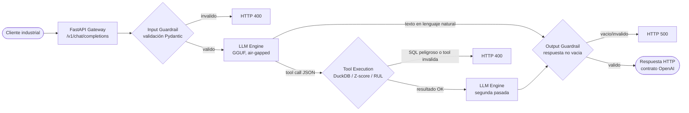
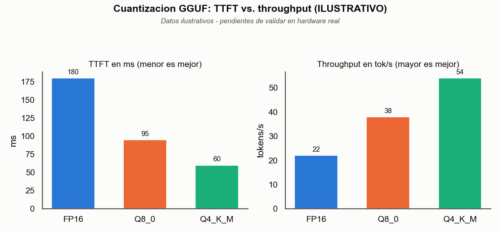
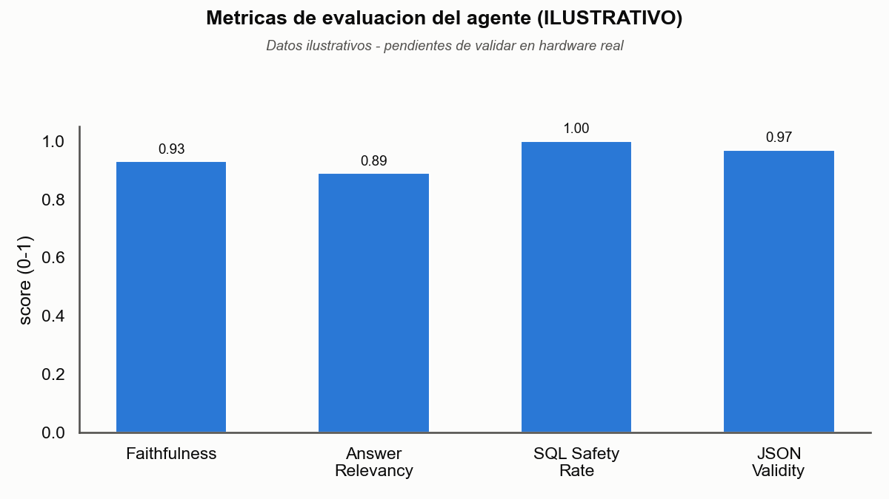

# SLM Industrial Gateway

Gateway HTTP compatible con OpenAI para un modelo de lenguaje pequeño (SLM)
adaptado por dominio a jerga industrial y minera, con ejecución de
herramientas analíticas (DuckDB, detección de anomalías, cálculo de RUL) y
guardrails de seguridad. Diseñado para desplegarse on-prem, sin dependencia
de red para la ruta de inferencia.

## Arquitectura

El sistema se compone de cinco módulos independientes bajo `src/`, integrados
por la capa de API:

```
                        ┌──────────────────────────────┐
                        │        src/api (FastAPI)      │
                        │  /v1/chat/completions          │
                        │  /v1/models  /health  /metrics │
                        └───────────────┬────────────────┘
                                        │ orquesta
        ┌───────────────────┬──────────┼──────────┬───────────────────┐
        ▼                   ▼                     ▼                   ▼
┌───────────────┐  ┌─────────────────┐  ┌──────────────────┐  ┌────────────────┐
│  src/engine    │  │   src/tools      │  │  src/guardrails  │  │ src/evaluation  │
│  LLMServer     │  │  ToolRegistry +  │  │  validate_sql_   │  │ Faithfulness/   │
│  (llama.cpp,   │  │  industrial_tools│  │  query,          │  │ Hallucination   │
│  GGUF, fallback│  │  (DuckDB, Z-score│  │  validate_json_  │  │ (DeepEval, para │
│  GPU→CPU)      │  │  anomalías, RUL) │  │  output          │  │ evaluación      │
└───────────────┘  └─────────────────┘  └──────────────────┘  │ offline, no en  │
                                                                 │ el request path)│
                                                                 └────────────────┘

        src/training (offline, no se ejecuta en el gateway)
        QLoRA (Unsloth + TRL SFTTrainer) sobre data/domain_dataset/
        → produce adaptadores LoRA que se cargan como el modelo GGUF
          cuantizado que consume src/engine.
```

`src/tools` depende de `src/guardrails` (todo query SQL y todo argumento de
tool pasa por un validador antes de ejecutarse). `src/api` depende de los
tres módulos de runtime (`engine`, `tools`, `guardrails`); `src/evaluation` y
`src/training` son pipelines offline, desacoplados del servicio HTTP.

### Flujo de datos de `/v1/chat/completions`



1. **Validación de entrada**: Pydantic valida el payload (`ChatCompletionRequest`);
   se rechaza con `400` si `messages` está vacío o no cumple el esquema.
2. **Inferencia SLM**: se construye un prompt que incluye el listado de tools
   disponibles (`ToolRegistry.list_tools()`) y las instrucciones de formato de
   tool call, y se invoca `LLMServer.generate()` (`src/engine`, backend
   llama.cpp sobre el modelo GGUF local).
3. **Ejecución de tool (si aplica)**: la respuesta del SLM se intenta parsear
   como `{"tool": "<nombre>", "arguments": {...}}`. Si no es JSON válido para
   ese esquema, se trata como respuesta final en lenguaje natural y se salta
   al paso 5. Si sí lo es, se despacha vía `ToolRegistry.dispatch()`
   (`src/tools`), que valida los argumentos contra el `args_schema` de la
   tool y —para `query_duckdb`— además contra `validate_sql_query`
   (`src/guardrails`): solo se permiten `SELECT/WITH/EXPLAIN/DESCRIBE/SHOW`,
   una única sentencia, sin palabras clave destructivas. El resultado de la
   tool se inyecta como un mensaje de rol `tool` y se vuelve a invocar al SLM
   para que redacte la respuesta final con ese contexto.
4. **Guardrails de salida**: antes de responder, se rechaza (`500`) una
   respuesta final vacía o inválida. Cualquier error de guardrail o de
   ejecución de tool (SQL peligroso, tool desconocida, argumentos inválidos)
   se traduce a `400`.
5. **Respuesta JSON**: se devuelve un `ChatCompletionResponse` con el mismo
   contrato que la API de OpenAI, y se registran métricas de Prometheus
   (tokens generados, latencia por token, resultado de la solicitud).

Todas las tools están protegidas por guardrails; ninguna tool ejecuta SQL de
escritura ni comandos del sistema.

## Benchmarks

> **Los números de esta sección son ilustrativos, no una medición real.** Este
> repositorio no tiene GPU ni un modelo GGUF cargado, así que todavía no hay
> una corrida real de `src/engine/benchmarks.run_benchmark` sobre FP16/Q8_0/
> Q4_K_M, ni una corrida real de `src/evaluation.FaithfulnessEvaluator` contra
> el agente. Los valores existen para dejar lista la infraestructura de
> reporte (`scripts/generate_plots.py`); hay que reemplazarlos por resultados
> reales antes de citarlos como medición de rendimiento.



| Cuantización | VRAM aprox. (7B) | TTFT (ms) | Throughput (tok/s) |
|--------------|-----------------:|----------:|--------------------:|
| FP16         | ~14 GB           | 180       | 22                   |
| Q8_0         | ~7.5 GB          | 95        | 38                   |
| Q4_K_M       | ~4.5 GB          | 60        | 54                   |

*VRAM aproximada para un modelo de 7B según el tamaño de archivo GGUF típico
de cada cuantización; TTFT y throughput son los mismos valores ilustrativos
del gráfico. Medir con `scripts/quantize.py --load` + `run_benchmark` sobre
el hardware real de destino.*



| Métrica            | Valor | Qué mide |
|---------------------|------:|----------|
| Faithfulness         | 0.93  | El `FaithfulnessMetric` de DeepEval: cuánto de la respuesta está sustentado por el contexto recuperado. |
| Answer Relevancy     | 0.89  | Qué tan pertinente es la respuesta final respecto a la pregunta del usuario. |
| SQL Safety Rate      | 1.00  | Fracción de intentos de `query_duckdb` con SQL peligroso correctamente bloqueados por `validate_sql_query`. |
| JSON Validity        | 0.97  | Fracción de tool calls emitidas por el SLM que parsean como `ToolCallEnvelope` sin error de esquema. |

Para regenerar ambos gráficos (con los mismos placeholders u otros datos ya
editados en el script):

```bash
python scripts/generate_plots.py
```

## Estructura del repositorio

```
src/
  engine/       LLMServer (GGUF/llama.cpp), benchmarks (t/s, TTFT, RAM/VRAM)
  api/          Gateway FastAPI, contrato OpenAI, métricas Prometheus
  tools/        ToolRegistry, herramientas industriales (query_duckdb,
                sensor_anomaly_check, calculate_rul)
  guardrails/   Validación de SQL y de salidas JSON estrictas
  evaluation/   Evaluador de fidelidad/alucinación (DeepEval, offline)
  training/     Pipeline QLoRA (dataset_prep.py, finetune.py)
data/
  domain_dataset/  Dataset sintético ChatML de dominio (telemetría/sensores)
  models/          Pesos GGUF locales (no versionado; ver instalación)
scripts/
  quantize.py       Verifica/carga modelos GGUF cuantizados (Q4_K_M, Q8_0)
  generate_plots.py Genera los gráficos de `outputs/reports/` (ver Benchmarks)
outputs/
  reports/        Gráficos versionados que embeben el README (PNG)
monitoring/
  prometheus.yml  Configuración de scraping para el contenedor Prometheus
tests/
  test_engine.py, test_api.py, test_tools.py, test_guardrails.py,
  test_eval.py, test_training.py, test_integration.py
```

## Guía de despliegue air-gapped

El servicio de inferencia (`src/engine` + `src/api`) no requiere red en
tiempo de ejecución: el modelo GGUF es un archivo local y llama.cpp corre
in-process. Los únicos puntos que sí asumen red por defecto son (a) la
instalación de dependencias Python y (b) el módulo de evaluación si se deja
apuntando a un juez alojado en la nube. Para un entorno sin salida a
Internet:

### 1. Dependencias Python (wheelhouse)

En una máquina con red (misma versión de Python/plataforma que el destino):

```bash
pip download -r requirements.txt -d wheelhouse/
```

Copiar `wheelhouse/` y `requirements.txt` al entorno aislado, e instalar ahí
sin acceso a PyPI:

```bash
pip install --no-index --find-links=wheelhouse/ -r requirements.txt
```

### 2. Montaje local de los pesos GGUF

El modelo nunca se descarga en tiempo de ejecución: `MODEL_PATH` apunta a un
archivo `.gguf` que ya tiene que estar en disco.

1. Copiar el archivo a `data/models/model.gguf` (o la ruta que indique
   `MODEL_PATH`); en Docker Compose esa carpeta se monta como volumen
   de solo lectura (`./data/models:/app/data/models:ro`), así que el `.gguf`
   nunca se copia dentro de la imagen ni queda expuesto por accidente.
2. Verificar el archivo (cabecera GGUF válida y cuantización detectada) y
   opcionalmente cargarlo en memoria para confirmar que arranca:

   ```bash
   python scripts/quantize.py data/models/model.gguf --load
   ```

### 3. Arranque offline vía Docker Compose

En la máquina con red, pre-cargar las imágenes base (no hay Dockerfile para
Prometheus: se usa la imagen oficial tal cual):

```bash
docker pull python:3.11-slim
docker pull prom/prometheus:v3.0.1
docker save python:3.11-slim prom/prometheus:v3.0.1 -o base-images.tar
```

En el destino aislado:

```bash
docker load -i base-images.tar
docker compose build   # usa solo wheelhouse/ y las imagenes ya cargadas, sin red
docker compose up -d
```

`docker compose build` no debe disparar ningún acceso a red si el
`Dockerfile` y `requirements.txt` están fijados a wheels ya presentes en
`wheelhouse/`; si el build intenta salir a Internet, es señal de una
dependencia sin pin exacto en `requirements.txt`.

### 4. Configuración de guardrails

Los guardrails (`src/guardrails/validators.py`) son intencionalmente
**código, no configuración**: la lista de verbos SQL permitidos
(`ALLOWED_SQL_VERBS`) y de palabras clave bloqueadas (`BLOCKED_SQL_KEYWORDS`)
son constantes fijas, sin variable de entorno ni flag que las relaje en
producción. Esto es deliberado en un entorno air-gapped: no hay superficie de
configuración en runtime que un operador pueda aflojar por error (o que un
prompt del propio SLM pueda intentar manipular). Para ampliar qué puede hacer
el agente, la vía soportada es agregar una tool nueva y explícita en
`src/tools/industrial_tools.py`, no relajar el validador SQL existente.

### 5. Evaluación offline sin salida a Internet

`src/evaluation` usa DeepEval con un modelo juez configurable
(`FaithfulnessEvaluator(judge_model=...)`). Por defecto apunta a
`gpt-4o-mini` (API externa). En un entorno aislado, apuntar
`OPENAI_BASE_URL`/`OPENAI_API_KEY` a un endpoint OpenAI-compatible servido
localmente (por ejemplo, este mismo gateway u otro servidor local), o
simplemente omitir la evaluación de fidelidad en producción: en CI,
`tests/test_eval.py` corre con las métricas de DeepEval mockeadas, sin red.

## Configuración (variables de entorno)

| Variable              | Default                          | Usado por         |
|-----------------------|-----------------------------------|-------------------|
| `MODEL_NAME`          | `local-slm`                       | `src/api` (metadata de `/v1/models`) |
| `MODEL_PATH`          | `data/models/model.gguf`          | `src/api` → `src/engine.LLMServer` |
| `MODEL_N_CTX`         | `4096`                            | `src/engine.LLMServer` (ventana de contexto) |
| `DEEPEVAL_JUDGE_MODEL`| `gpt-4o-mini`                      | `src/evaluation.FaithfulnessEvaluator` |
| `OPENAI_API_KEY`      | (vacío)                           | Cliente del modelo juez de DeepEval |
| `OPENAI_BASE_URL`     | (vacío)                           | Cliente del modelo juez de DeepEval (endpoint local en despliegues aislados) |

## Ejecutar localmente

```bash
pip install -r requirements.txt
export MODEL_PATH=data/models/model.gguf   # o el path real al .gguf
python -m uvicorn src.api:app --host 0.0.0.0 --port 8000
```

## Ejecutar con Docker Compose

```bash
docker compose up -d --build
```

Expone:
- API: `127.0.0.1:8000` (`/v1/chat/completions`, `/v1/models`, `/health`, `/metrics`)
- Prometheus: `127.0.0.1:9090`, con scraping ya configurado hacia
  `slm-api:8000/metrics` (ver `monitoring/prometheus.yml`)

Ambos puertos están atados a `127.0.0.1` deliberadamente: el servicio no se
expone a la red pública por defecto.

## Pruebas

```bash
pytest -v
```

Por módulo:

```bash
pytest tests/test_engine.py -v        # LLMServer, fallback GPU→CPU, benchmarks
pytest tests/test_api.py -v           # Contrato HTTP, LLM mockeado
pytest tests/test_tools.py -v         # Tools industriales + ToolRegistry
pytest tests/test_guardrails.py -v    # Validación de SQL y de JSON de salida
pytest tests/test_eval.py -v          # Evaluador de fidelidad (métricas mockeadas)
pytest tests/test_training.py -v      # Dataset ChatML, config y args de QLoRA
pytest tests/test_integration.py -v   # End-to-end: API + tools + guardrails reales
```

`tests/test_integration.py` monta un `TestClient` de FastAPI y ejercita el
flujo completo descrito arriba con DuckDB y los guardrails corriendo de
verdad; solo `LLMServer.generate` se simula, porque no hay pesos GGUF en CI.

`tests/test_training.py` no requiere GPU: valida el dataset, el formateo
ChatML y la construcción de `QLoRATrainingConfig`/`SFTConfig`, pero no
entrena. El entrenamiento real (`src/training/finetune.py`) requiere una GPU
con soporte CUDA y `unsloth` + `bitsandbytes` instalados.

## Notas de compatibilidad de dependencias

`unsloth` fija transitivamente el resto del stack de fine-tuning. En
concreto, `unsloth==2026.9.5` requiere `trl<=0.24.0`, mientras que
`trl>=1.0` requiere `transformers>=4.56.2` pero es incompatible con ese techo
de `unsloth`. `requirements.txt` fija `trl==0.24.0` (no la línea 1.x) junto
con `transformers==4.56.2`, `peft==0.21.0`, `accelerate==1.15.0`,
`datasets==4.3.0`, `bitsandbytes==0.50.2` y `torch==2.12.1`, todos dentro de
los rangos que `unsloth` declara soportar. Antes de subir cualquiera de estas
versiones, revisar la metadata de distribución de `unsloth` para confirmar
que el nuevo rango sigue siendo compatible.

## Seguridad y guardrails

- **SQL**: `query_duckdb` solo ejecuta una única sentencia `SELECT/WITH/
  EXPLAIN/DESCRIBE/SHOW`; se bloquean `DROP/DELETE/ALTER/INSERT/UPDATE/
  CREATE/ATTACH/EXEC/...` aunque aparezcan en subconsultas o tras comentarios.
- **Salidas estructuradas**: toda tool valida sus argumentos contra un
  esquema Pydantic en modo estricto (sin coerción de tipos), y rechaza
  campos desconocidos.
- **Guardrail de salida del SLM**: se rechaza una respuesta final vacía antes
  de devolverla al cliente.
