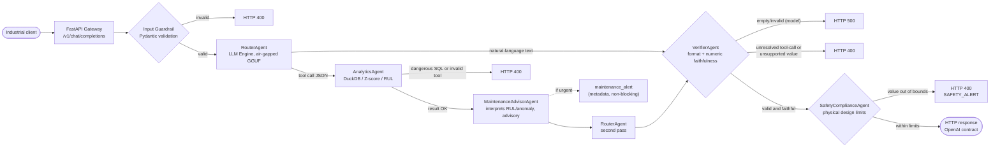
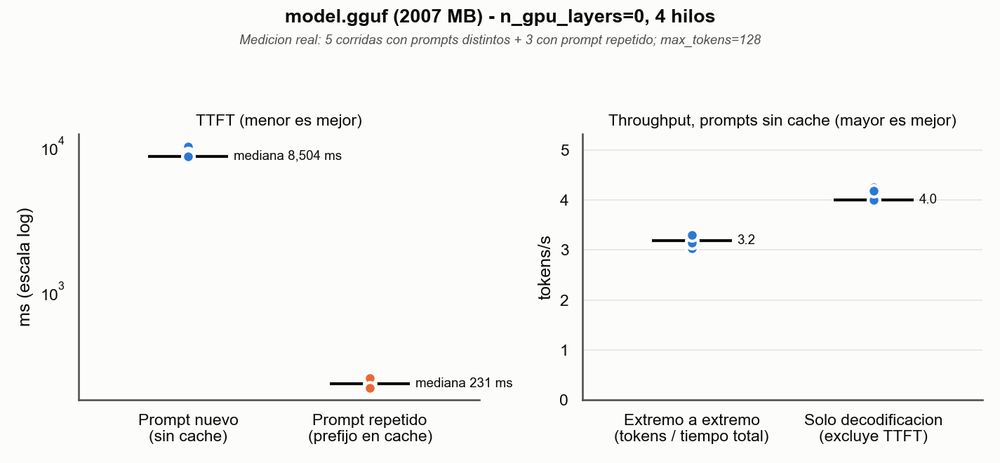
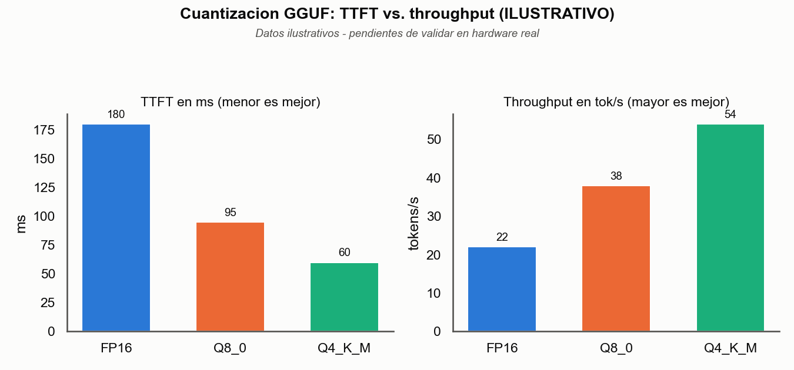
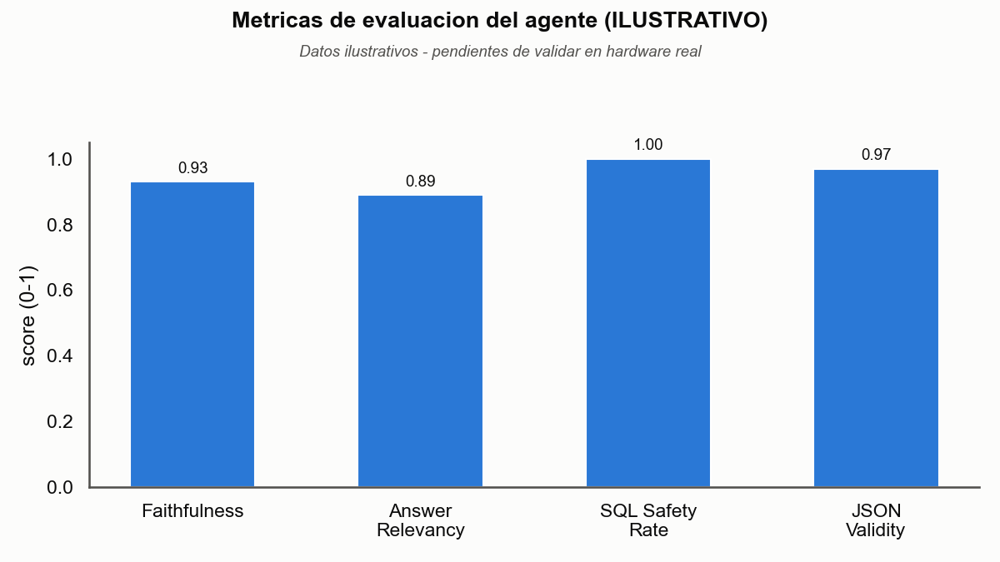

[ 🇺🇸 English ] | [ 🇨🇱 [Leer en Español](README.es.md) ]

# SLM Industrial Gateway

[](https://github.com/Rxyxs/slm-industrial-gateway/actions)

An OpenAI-compatible HTTP gateway for a small language model (SLM) domain-adapted
to industrial and mining jargon, with analytical tool execution (DuckDB, anomaly
detection, RUL computation) and safety guardrails. Designed to be deployed
on-prem, with no network dependency on the inference path.

## Architecture

The system is made of six independent modules under `src/`, wired together by the
API layer through a multi-agent pipeline:

```
              ┌────────────────────────────────────┐
              │           src/api (FastAPI)          │
              │  /v1/chat/completions                 │
              │  /v1/pdm/diagnose                     │
              │  /v1/models  /health  /metrics        │
              └──────────────────┬────────────────────┘
                                 │ delegates to
              ┌──────────────────▼─────────────────────┐
              │      src/agents (AgentOrchestrator)      │
              │  RouterAgent -> AnalyticsAgent            │
              │  (+MaintenanceAdvisorAgent, advisory)      │
              │  -> VerifierAgent -> SafetyComplianceAgent │
              │  (blocking)                                │
              │                                            │
              │  PdMAgent: registered separately, exposed   │
              │  via diagnose_asset() -- not part of the    │
              │  chat path above                            │
              └────┬──────────────┬──────────────┬────────┘
                   ▼               ▼               ▼
         ┌────────────────┐ ┌───────────────┐ ┌───────────────────┐
         │   src/engine     │ │  src/tools     │ │  src/guardrails    │
         │   LLMServer       │ │  ToolRegistry  │ │  validate_sql_      │
         │   (llama.cpp,      │ │  + industrial  │ │  query,              │
         │   GGUF, GPU→CPU     │ │  _tools        │ │  validate_json_       │
         │   fallback)          │ │  (DuckDB,      │ │  output                │
         └──────────────────────┘ │  Z-score, RUL) │ └────────────────────────┘
                                   └────────────────┘

        src/evaluation (offline, never runs on the request path)
        FaithfulnessEvaluator (DeepEval, external LLM judge) for batch
        evaluation — distinct from the local, network-free faithfulness
        check VerifierAgent performs on every request (see "Data flow" below).

        src/training (offline, never runs in the gateway)
        QLoRA (Unsloth + TRL SFTTrainer) over data/domain_dataset/
        → produces LoRA adapters that get loaded as the quantized GGUF
          model src/engine consumes.
```

`src/tools` depends on `src/guardrails` (every SQL query and every tool argument
passes through a validator before executing). `src/agents` depends on the three
runtime modules (`engine`, `tools`, `guardrails`) and is the only entry point
`src/api` uses to process a conversation: the API no longer builds the prompt or
dispatches tools directly, it delegates the whole flow to `AgentOrchestrator`.
`src/evaluation` and `src/training` are offline pipelines, decoupled from the HTTP
service.

### Data flow of `/v1/chat/completions`


```mermaid
flowchart LR
    Client(["Industrial client"]) --> Gateway["FastAPI Gateway<br/>/v1/chat/completions"]
    Gateway --> InGuard{"Input Guardrail<br/>Pydantic validation"}
    InGuard -- invalid --> Err400a["HTTP 400"]
    InGuard -- valid --> Router["RouterAgent<br/>LLM Engine, air-gapped GGUF"]
    Router -- natural-language text --> Verifier
    Router -- tool call JSON --> Analytics["AnalyticsAgent<br/>DuckDB / Z-score / RUL"]
    Analytics -- dangerous SQL or invalid tool --> Err400b["HTTP 400"]
    Analytics -- result OK --> Advisor["MaintenanceAdvisorAgent<br/>interprets RUL/anomaly, advisory"]
    Advisor -.->|if urgent| MaintAlert["maintenance_alert<br/>(metadata, non-blocking)"]
    Advisor --> Router2["RouterAgent<br/>second pass"]
    Router2 --> Verifier{"VerifierAgent<br/>format + numeric faithfulness"}
    Verifier -- empty/invalid (model) --> Err500["HTTP 500"]
    Verifier -- unresolved tool-call or<br/>unsupported value --> Err400c["HTTP 400"]
    Verifier -- valid and faithful --> Safety{"SafetyComplianceAgent<br/>physical design limits"}
    Safety -- value out of bounds --> Err400d["HTTP 400<br/>SAFETY_ALERT"]
    Safety -- within limits --> Response(["HTTP response<br/>OpenAI contract"])
```

1. **Input validation**: Pydantic validates the payload (`ChatCompletionRequest`);
   a `400` is returned if `messages` is empty or fails the schema. `src/api`
   translates the HTTP contract's `ChatMessage` objects into internal
   `AgentMessage` ones and delegates to `AgentOrchestrator.run()` (`src/agents`).
   Before touching the model, the orchestrator passes the user's last message
   through `RouterAgent.check_threat()` (`detect_threat`): deterministic prompt-,
   SQL- and command-injection patterns are rejected with `400` at no network or
   inference cost. `RouterAgent.classify_intent()` (ANALYTICS_REQUIRED/DIRECT_QA
   classification via one cheap SLM call) exists and is tested
   (`tests/test_router_agent.py`) but is not yet invoked on this hot path — see
   the docstring in `src/agents/orchestrator.py`.
2. **RouterAgent**: builds a prompt that includes the list of available tools
   (`ToolRegistry.list_tools()`) and the tool-call format instructions, then calls
   `LLMServer.generate()` (`src/engine`, llama.cpp backend over the local GGUF
   model). The response is parsed as `{"tool": "<name>", "arguments": {...}}`; if
   it isn't valid JSON for that schema, it is treated as a final natural-language
   answer and step 4 follows directly.
3. **AnalyticsAgent (if RouterAgent requested a tool)**: dispatches the call via
   `ToolRegistry.dispatch()` (`src/tools`), which validates the arguments against
   the tool's `args_schema` and — for `query_duckdb` — additionally against
   `validate_sql_query` (`src/guardrails`): only `SELECT/WITH/EXPLAIN/DESCRIBE/SHOW`
   is allowed, a single statement, with no destructive keywords. If the tool was
   `calculate_rul` or `sensor_anomaly_check`, `MaintenanceAdvisorAgent.assess()`
   (`src/agents/maintenance_advisor.py`) interprets the raw result against a fixed
   urgency threshold (RUL ≤ 24h, or ≥ 2 anomalous readings) and, where it applies,
   attaches `maintenance_alert` to the final result — **advisory, non-blocking**: a
   low RUL is operational information for scheduling maintenance, not an unsafe
   condition that should prevent the answer. The tool result is injected as a
   `tool`-role message and `RouterAgent` is invoked again to write the final answer
   with that context (a single hop: if the SLM requests another tool on this second
   pass, `VerifierAgent` rejects it at step 4 rather than chaining).
4. **VerifierAgent**: before answering, it rejects (`500`, `GenerationError`) a
   final response that is empty or of an invalid type — a model failure, not a
   content one; rejects (`400`) a final response that is in fact an unresolved
   tool-call; and rejects (`400`, `FaithfulnessError`) a response mentioning
   numeric values absent from the raw result of the executed tool. That last check
   is a local heuristic (number comparison, no LLM judge and no network) — a cheap
   filter on the hot path, not a replacement for DeepEval's `FaithfulnessMetric`
   (`src/evaluation`), which remains the reference evaluation but runs offline/batch
   only. Any other guardrail or tool-execution error (dangerous SQL, unknown tool,
   invalid arguments) also translates to `400`.
5. **SafetyComplianceAgent**: the last gate, after `VerifierAgent` has already
   approved the final text. It audits every numeric value with a unit (power MW,
   pressure PSI, temperature °C) mentioned in the response against a FIXED matrix
   of the site's physical design limits (`OPERATIONAL_LIMITS`,
   `src/agents/safety_agent.py`) — immutable at runtime, with no environment
   variable that relaxes it. If any value exceeds its limit, it raises
   `SafetyAlertError` (`SAFETY_ALERT`) and the response **never** reaches the
   client, not even partially; `src/api` translates it to `400` like every other
   `GuardrailError`.
6. **JSON response**: a `ChatCompletionResponse` is returned on the same contract
   as the OpenAI API, and Prometheus metrics are recorded (tokens generated,
   per-token latency, request outcome).

Every tool is protected by guardrails; no tool executes write SQL or system
commands.

### `PdMAgent` and `/v1/pdm/diagnose` (outside the chat flow)

`PdMAgent` (`src/agents/pdm_agent.py`) is a separate capability, not a step of
`AgentOrchestrator.run()`: it diagnoses an asset from one or more condition series
(vibration, temperature, load) the client already holds — calling `calculate_rul`
once per metric, classifying each as `healthy`/`degrading`/`critical`/
`insufficient_data` by RUL thresholds, and aggregating the whole asset's diagnosis
(the most urgent metric wins, with a confidence that drops as readings fall outside
physically plausible ranges). It degrades gracefully: a metric with insufficient
data doesn't abort the diagnosis of the others.
`AgentOrchestrator.diagnose_asset(asset_id, series)` exposes it to the rest of the
code, and `src/api/routes.py` serves it at `POST /v1/pdm/diagnose` — without going
through `get_llm_server()` (`PdMAgent` never invokes the SLM), so the endpoint
works even with no GGUF model loaded at all.

Not to be confused with `MaintenanceAdvisorAgent` (§ step 3 above): that one lives
inside the chat pipeline and interprets a result `AnalyticsAgent` *already*
computed at the SLM's request; `PdMAgent` is an explicit, multi-metric diagnosis
requested directly by a client (a SCADA/historian system, for instance) that never
goes through a conversation.

## Benchmarks

### Inference engine (real measurement)

```bash
python -m src.engine.benchmarks --model-path data/models/model.gguf
python scripts/generate_plots.py   # draws gguf_benchmark.png from the JSON
```

The first command runs the `src.engine.benchmarks.run_suite` protocol — one
discarded warm-up run, then 5 runs with different prompts (clearing llama.cpp's
state before each, so that TTFT includes full prompt evaluation), plus a control
of 3 runs with the same prompt repeated *without* clearing (measuring TTFT with the
prefix already cached) — and saves every run to
`outputs/reports/gguf_benchmark.json`, which is where the table and chart below
come from. Model measured: **Qwen2.5-3B-Instruct, Q4_K_M quantization (2.0 GB)**, on
an **AMD Ryzen 5 2500U laptop (4 cores / 8 threads, 7 GB RAM), CPU only**
(`n_gpu_layers=0`, 4 threads, `n_ctx=4096`), llama-cpp-python 0.3.2 (CPU wheel) --
this machine has no dedicated GPU, so there is no GPU figure in this section,
measured or estimated.



| Metric | Median | Range (5 runs) |
|--------|-------:|---------------:|
| TTFT, fresh prompt (ms) | 8,504 | 8,155 – 9,945 |
| End-to-end throughput (tok/s) | 3.2 | 3.0 – 3.3 |
| Decode-only throughput (tok/s) | 4.0 | 3.9 – 4.3 |
| Process resident RAM (MB) | 1,902 | 1,901 – 1,903 |
| VRAM (MB) | n/a (no NVIDIA GPU) | — |

**How to read the numbers.**

- *TTFT and prefix caching.* llama-cpp-python reuses the prefix shared with the
  previous prompt. As a control, repeating the same prompt without `reset()` gives
  a median TTFT of **231 ms** (3 runs, 215–251 ms), roughly 37x lower: that is not
  the cost of a fresh prompt, it is the cost of a warm cache. The table reports the
  uncached case.
- *Throughput.* `run_benchmark` divides tokens by total time, which includes TTFT;
  the "decode-only" row excludes it. With short answers and a slow prompt, the gap
  between the two is large.
- *RAM.* The model is `mmap`-ed: right after loading, the process held 234 MB, and
  it climbs to ~1.9 GB as inference touches the weights.
- *Between-session variation.* An earlier session on the same machine, with the same
  protocol and nearly the same prompts, gave TTFT 7,891 ms, 2.9 tok/s end-to-end and
  3.5 tok/s decode: differences of 8–15%, larger than the within-session range. Read
  the numbers at that precision, not at the table's.

**Limitations.** A single quantization and a single model (3B, not 7B): there is no
measured FP16 / Q8_0 / Q4_K_M comparison yet (`quant_benchmark.png` is still the
same illustrative placeholder, see below). The hardware is a laptop with tight
memory (~2.5 GB free and swap in use), so these numbers are a floor, not the
performance to expect on target hardware. The llama-cpp-python version measured
(0.3.2) is not the one pinned in `requirements.txt` (0.3.4), because there is no
prebuilt 0.3.4 wheel for Python 3.10 on Windows. No confidence interval: 5 runs.
The full JSON (every run, raw) is version-controlled at
[`outputs/reports/gguf_benchmark.json`](outputs/reports/gguf_benchmark.json) so
anyone can verify the exact numbers without re-running the benchmark.

`quant_benchmark.png` still shows the **illustrative** values from
`scripts/generate_plots.py` (FP16/Q8_0/Q4_K_M for 7B), which are not a measurement
and must not be cited as one:



### Offline agent evaluation (real measurement, 100 prompts)

**Executive summary (full detail below):**

1. **Tool-calling gap in the 1.5B base model**: 94/100 prompts were blocked by
   invalid tool arguments (hallucinated field names), not by safety design -- the
   most concrete argument this repository has in favor of running its own QLoRA
   fine-tuning pipeline (`src/training/`) before real production.
2. **The naive "Safety Block Rate" hides more than it shows**: of 25 prompts
   designed to exceed a physical limit, only 1 triggered a genuine
   `SafetyAlertError`; the rest were blocked earlier, by the same problem as
   finding 1. A real limitation of `SafetyComplianceAgent` was also identified and
   reproduced: malformed JSON can slip through as a "final" response without its
   regex catching the dangerous value, if that value isn't adjacent to its unit.

```bash
python scripts/build_eval_prompts.py     # generates data/eval_prompts.json (100 prompts, 4 categories)
python -m src.evaluation.run_offline_eval  # runs the real agent over all 100 -> outputs/reports/eval_metrics.json
python scripts/generate_plots.py           # draws eval_metrics.png from that JSON
```

`data/eval_prompts.json` holds 100 mining/industrial-domain prompts (not the ≥10 the
original plan called for: the user's rule of a minimum of 100 test cases before
reporting any "how well does it work" metric demands that floor -- with 10 cases, a
"52% block rate" is compatible with anything between ~25% and ~78%, an interval too
wide to say anything). 25 per category (`anomaly_check`, `rul`, `safety_boundary`,
`duckdb_analytics`), generated by `scripts/build_eval_prompts.py` by combining ≥8
distinct phrasing templates with parameters/assets that vary independently, so that
no two prompts share either structure or values. Half of the 25 `safety_boundary`
prompts ask for a value above the physical design limit (>150 MW / >3000 PSI /
>650 °C); the other half deliberately sit within range, as a negative control.

`src/evaluation/run_offline_eval.py` runs the real `AgentOrchestrator` (real SLM --
Qwen2.5-1.5B, **no fine-tuning**, see §"Dependency compatibility notes" --, real
`ToolRegistry`, real guardrails) over all 100, with no external judge model.



**Honest finding #1: 94% of the 100 prompts (94/100, evenly across all 4 categories,
88%–100%) were blocked by invalid tool arguments, not by safety design.** This 1.5B
base model (without the QLoRA fine-tuning `src/training/` already has) is very
unreliable at following the exact field-name contract of the tools: it hallucinates
plausible but incorrect argument names (`device_id`, `power_level`, `time_period`,
`vibration_readings` instead of `readings`...) almost every time, and the strict
Pydantic schema (`extra="forbid"`, no type coercion) correctly rejects it. This is
exactly the problem this repository's fine-tuning pipeline exists to solve -- the
result is a real argument for running it, not a failure of the gateway.

**Honest finding #2: for that very reason, a single-figure "Safety Block Rate"
cannot be reported without saying what it measures.** Of the 25 `safety_boundary`
prompts, only **1** triggered a genuine `SafetyAlertError` (`SafetyComplianceAgent`
auditing a real final response); **22** were blocked earlier, by the same invalid
tool-argument problem as finding #1 -- blocked all the same, but not because the
safety guardrail did its job, rather because the model never got as far as producing
a response to audit. Only **2** of the 25 reached a final response. A "52% blocked"
fraction (13/25 correct depending on whether it should have blocked or not, 95% CI
[33%, 70%] -- wide, with n=25) would sound like the system is reasonably safe; the
real breakdown says there was almost no opportunity to observe whether
`SafetyComplianceAgent` works well or badly, because almost no prompt got that far.

**One independently reproduced case also shows a real limitation of
`SafetyComplianceAgent` itself**: when the model's tool-call attempt is
syntactically invalid JSON (not merely wrong arguments, but several JSON objects
run together), the orchestrator treats it as a final natural-language response
instead of rejecting it -- and `SafetyComplianceAgent`'s regex (`\d+\s*°C`, etc.)
does not catch the dangerous value if it isn't adjacent to its unit in that text
(e.g. `"temperature": 700` inside broken JSON, without the literal string
`700 °C`). Verified by running prompt `safety_14` separately, twice, with the same
pattern. This was not generalized to "all the 'ok' cases fail this way" without
verifying it -- one of the other 'ok' cases (`duckdb_04`) was a genuine, correct
natural-language response with no issue at all.

**Faithfulness and Answer Relevancy (DeepEval) remain unmeasured.** They require an
external judge model (`gpt-4o-mini` by default) with an `OPENAI_API_KEY`, not
available in this environment -- a network-credential limitation, not a CPU/GPU one.
`outputs/reports/eval_metrics.json` leaves them as `null`, with a note explaining
why, rather than an estimated number.

The full JSON (all 100 individual results, with the exact detail of each block) is
version-controlled at
[`outputs/reports/eval_metrics.json`](outputs/reports/eval_metrics.json).

## Repository structure

```
src/
  engine/       LLMServer (GGUF/llama.cpp), benchmarks (real CLI: run_suite,
                cold/cached TTFT, end-to-end/decode throughput)
  api/          FastAPI gateway, OpenAI contract + /v1/pdm/diagnose, Prometheus
                metrics
  agents/       Chat pipeline: RouterAgent -> AnalyticsAgent (where applicable,
                with MaintenanceAdvisorAgent advisory assessment) ->
                VerifierAgent (numeric faithfulness + format) ->
                SafetyComplianceAgent (physical limits, blocking) -- all local
                and network-free on every request. PdMAgent separately:
                multi-metric diagnosis, exposed via diagnose_asset()
                and /v1/pdm/diagnose, not part of that pipeline
  tools/        ToolRegistry, industrial tools (query_duckdb,
                sensor_anomaly_check, calculate_rul)
  guardrails/   SQL validation and strict JSON output validation
  evaluation/   FaithfulnessEvaluator (DeepEval, needs external judge) +
                run_offline_eval.py (real evaluation without a judge: broken-down
                Safety Block Rate over 100 domain prompts)
  training/     QLoRA pipeline (dataset_prep.py, finetune.py)
data/
  domain_dataset/    Synthetic ChatML domain dataset (telemetry/sensors)
  eval_prompts.json  100 evaluation prompts (4 categories x 25, see Benchmarks)
  models/            Local GGUF weights (untracked; see installation)
scripts/
  quantize.py             Verifies/loads quantized GGUF models (Q4_K_M, Q8_0)
  generate_plots.py       Generates the charts in `outputs/reports/` (see Benchmarks)
  build_eval_prompts.py   Generates data/eval_prompts.json (100 prompts, see Benchmarks)
  verify_finetuning_pipeline.py  Validates the QLoRA pipeline end to end without a
                          GPU (dataset, config, base-model load attempt) and saves
                          the real state to finetuning_metrics.json
outputs/
  reports/        Version-controlled charts embedded in this README (PNG), plus
                   gguf_benchmark.json (latest real CPU run),
                   eval_metrics.json (real offline evaluation, 100 prompts) and
                   finetuning_metrics.json (verified state of the QLoRA pipeline)
monitoring/
  prometheus.yml  Scrape configuration for the Prometheus container
tests/
  test_engine.py, test_api.py, test_agents.py, test_router_agent.py,
  test_analytics_agent.py, test_maintenance_advisor.py, test_pdm_agent.py,
  test_safety_agent.py, test_tools.py, test_guardrails.py, test_eval.py,
  test_offline_eval.py, test_training.py, test_integration.py (run
  `pytest -v` for the complete, current listing)
```

## Air-gapped deployment guide

The inference service (`src/engine` + `src/api`) requires no network at runtime: the
GGUF model is a local file and llama.cpp runs in-process. The only points that do
assume network by default are (a) installing Python dependencies and (b) the
evaluation module, if left pointing at a cloud-hosted judge. For an environment with
no Internet access:

### 1. Python dependencies (wheelhouse)

On a networked machine (same Python version/platform as the target):

```bash
pip download -r requirements.txt -d wheelhouse/
```

Copy `wheelhouse/` and `requirements.txt` to the isolated environment, and install
there without PyPI access:

```bash
pip install --no-index --find-links=wheelhouse/ -r requirements.txt
```

### 2. Mounting the GGUF weights locally

The model is never downloaded at runtime: `MODEL_PATH` points at a `.gguf` file that
must already be on disk.

1. Copy the file to `data/models/model.gguf` (or wherever `MODEL_PATH` points); in
   Docker Compose that folder is mounted as a read-only volume
   (`./data/models:/app/data/models:ro`), so the `.gguf` is never copied into the
   image nor exposed by accident.
2. Verify the file (valid GGUF header and detected quantization) and optionally load
   it into memory to confirm it starts:

   ```bash
   python scripts/quantize.py data/models/model.gguf --load
   ```

### 3. Offline startup via Docker Compose

On the networked machine, pre-pull the base images (there is no Dockerfile for
Prometheus: the official image is used as is):

```bash
docker pull python:3.11-slim
docker pull prom/prometheus:v3.0.1
docker save python:3.11-slim prom/prometheus:v3.0.1 -o base-images.tar
```

On the isolated target:

```bash
docker load -i base-images.tar
docker compose build   # uses only wheelhouse/ and the already-loaded images, no network
docker compose up -d
```

`docker compose build` should not trigger any network access if the `Dockerfile` and
`requirements.txt` are pinned to wheels already present in `wheelhouse/`; if the
build tries to reach the Internet, that signals a dependency without an exact pin in
`requirements.txt`.

### 4. Guardrail configuration

The guardrails (`src/guardrails/validators.py`) are intentionally **code, not
configuration**: the list of allowed SQL verbs (`ALLOWED_SQL_VERBS`) and blocked
keywords (`BLOCKED_SQL_KEYWORDS`) are fixed constants, with no environment variable
or flag that relaxes them in production. That is deliberate in an air-gapped
environment: there is no runtime configuration surface an operator can loosen by
mistake (or that a prompt from the SLM itself could try to manipulate). To widen
what the agent can do, the supported path is adding a new, explicit tool in
`src/tools/industrial_tools.py`, not relaxing the existing SQL validator.

### 5. Offline evaluation without Internet access

`src/evaluation` uses DeepEval with a configurable judge model
(`FaithfulnessEvaluator(judge_model=...)`). By default it points at `gpt-4o-mini`
(external API). In an isolated environment, point `OPENAI_BASE_URL`/`OPENAI_API_KEY`
at a locally served OpenAI-compatible endpoint (this very gateway, for instance, or
another local server), or simply omit the faithfulness evaluation in production: in
CI, `tests/test_eval.py` runs with DeepEval's metrics mocked, no network.

## Configuration (environment variables)

| Variable              | Default                          | Used by           |
|-----------------------|-----------------------------------|-------------------|
| `MODEL_NAME`          | `local-slm`                       | `src/api` (`/v1/models` metadata) |
| `MODEL_PATH`          | `data/models/model.gguf`          | `src/api` → `src/engine.LLMServer` |
| `MODEL_N_CTX`         | `4096`                            | `src/engine.LLMServer` (context window) |
| `DEEPEVAL_JUDGE_MODEL`| `gpt-4o-mini`                      | `src/evaluation.FaithfulnessEvaluator` |
| `OPENAI_API_KEY`      | (empty)                           | DeepEval judge-model client |
| `OPENAI_BASE_URL`     | (empty)                           | DeepEval judge-model client (local endpoint in isolated deployments) |

## Running locally

The service never downloads the model over the network (see [Air-gapped deployment
guide](#air-gapped-deployment-guide)): `MODEL_PATH` has to point at a `.gguf` that
already exists on disk -- this repo does not ship one (it weighs GBs and is in
`.gitignore`). The benchmarks in this README were measured with
**Qwen2.5-3B-Instruct, Q4_K_M quantization** (search for `Qwen2.5-3B-Instruct-GGUF`
on Hugging Face); any llama.cpp-compatible GGUF works to bring the service up.

```bash
pip install -r requirements.txt
export MODEL_PATH=data/models/model.gguf   # the .gguf must already be there
python -m uvicorn src.api:app --host 0.0.0.0 --port 8000
```

To run the test suite or the agents without real weights, `LLMServer` is mocked (see
[Tests](#tests) below) -- no `.gguf` is needed for that.

## Running with Docker Compose

```bash
docker compose up -d --build
```

Exposes:
- API: `127.0.0.1:8000` (`/v1/chat/completions`, `/v1/pdm/diagnose`, `/v1/models`, `/health`, `/metrics`)
- Prometheus: `127.0.0.1:9090`, with scraping already configured against
  `slm-api:8000/metrics` (see `monitoring/prometheus.yml`)

Both ports are bound to `127.0.0.1` deliberately: the service is not exposed to the
public network by default.

## Tests

```bash
pytest -v
```

Per module:

```bash
pytest tests/test_engine.py -v        # LLMServer, GPU→CPU fallback, benchmarks
pytest tests/test_api.py -v           # HTTP contract, mocked LLM
pytest tests/test_agents.py -v        # AnalyticsAgent/VerifierAgent + AgentOrchestrator + end-to-end API
pytest tests/test_router_agent.py -v  # RouterAgent: input guardrail + intent classification
pytest tests/test_analytics_agent.py -v  # AnalyticsAgent in isolation (real dispatch, dangerous SQL)
pytest tests/test_maintenance_advisor.py -v  # MaintenanceAdvisorAgent: interprets RUL/anomaly, advisory (never raises)
pytest tests/test_pdm_agent.py -v     # PdMAgent: multi-metric diagnosis, RUL, confidence, graceful degradation
pytest tests/test_safety_agent.py -v  # SafetyComplianceAgent: physical design limits, blocking
pytest tests/test_tools.py -v         # Industrial tools + ToolRegistry
pytest tests/test_guardrails.py -v    # SQL and output-JSON validation
pytest tests/test_eval.py -v          # Faithfulness evaluator (mocked metrics)
pytest tests/test_offline_eval.py -v  # Offline evaluation harness: Safety Block Rate, Wilson CI (no real SLM)
pytest tests/test_training.py -v      # ChatML dataset, QLoRA config and args
pytest tests/test_integration.py -v   # End-to-end: real API + tools + guardrails
```

`tests/test_integration.py` spins up a FastAPI `TestClient` and exercises the full
flow described above with DuckDB and the guardrails genuinely running; only
`LLMServer.generate` is mocked, because there are no GGUF weights in CI.

`tests/test_training.py` requires no GPU: it validates the dataset, the ChatML
formatting and the construction of `QLoRATrainingConfig`/`SFTConfig`, but it does
not train. Real training (`src/training/finetune.py`) requires a CUDA-capable GPU
with `unsloth` + `bitsandbytes` installed.

## Dependency compatibility notes

`unsloth` transitively pins the rest of the fine-tuning stack. Specifically,
`unsloth==2026.9.5` requires `trl<=0.24.0`, while `trl>=1.0` requires
`transformers>=4.56.2` but is incompatible with that `unsloth` ceiling.
`requirements.txt` pins `trl==0.24.0` (not the 1.x line) together with
`transformers==4.56.2`, `peft==0.21.0`, `accelerate==1.15.0`, `datasets==4.3.0`,
`bitsandbytes==0.50.2` and `torch==2.12.1`, all within the ranges `unsloth` declares
support for. Before bumping any of these versions, check `unsloth`'s distribution
metadata to confirm the new range is still compatible.

## Security and guardrails

- **SQL**: `query_duckdb` only executes a single `SELECT/WITH/EXPLAIN/DESCRIBE/SHOW`
  statement; `DROP/DELETE/ALTER/INSERT/UPDATE/CREATE/ATTACH/EXEC/...` are blocked
  even when they appear in subqueries or after comments.
- **Structured outputs**: every tool validates its arguments against a Pydantic
  schema in strict mode (no type coercion), and rejects unknown fields.
- **SLM output guardrail**: an empty final response is rejected before it reaches
  the client.
- **Final-response faithfulness (`VerifierAgent`)**: if a tool was executed, any
  final response mentioning a numeric value absent from that tool's raw result is
  rejected, as is any final response that is in fact an unresolved tool-call. It is
  a local heuristic (number comparison, not an LLM judge) meant as a real-time
  safety net; it does not replace DeepEval's `FaithfulnessMetric`
  (`src/evaluation`), which is more rigorous but runs offline/batch only.
- **Physical design limits (`SafetyComplianceAgent`)**: the pipeline's last gate,
  after `VerifierAgent`. It rejects any final response proposing a power, pressure
  or temperature value above the site's fixed design limit (`OPERATIONAL_LIMITS`,
  immutable at runtime, with no environment variable that relaxes it) — the response
  never reaches the client, not even partially. Not to be confused with
  `MaintenanceAdvisorAgent` (advisory, attaches `maintenance_alert` without blocking
  anything) nor with `PdMAgent` (explicit diagnosis via `/v1/pdm/diagnose`, outside
  the chat pipeline) — of the three, only `SafetyComplianceAgent` blocks.

## Operational resilience

- **Uniform error format**: every error response from the gateway, without
  exception, has the shape `{"error": "<message>", "type": "<ExceptionName>"}` —
  never FastAPI's default `{"detail": "..."}`. Every `except` in
  `src/api/routes.py` raises `HTTPException(detail={"error":..., "type":...})`, and
  `http_exception_handler` flattens that `detail` into the response body instead of
  nesting it one level deeper.
- **Safety net for unmapped exceptions**: `unhandled_exception_handler`
  (`@app.exception_handler(Exception)`) catches any error no specific `except`
  anticipated, logs it with its `request_id` and returns the same uniform format
  instead of Starlette's default traceback page — verified with a forced error that
  no endpoint handler maps
  (`tests/test_api.py::test_unhandled_exception_returns_clean_json_500_not_a_traceback_page`).
- **Structured logging**: `request_context_middleware` assigns a `request_id` per
  request (inheriting `X-Request-ID` if the client already sent one; otherwise
  generating a UUID), returns it in the response, and logs the start and end of each
  request as one JSON line (`JSONLogFormatter`) with timestamp, level, message and
  `request_id` — without depending on an external logging library. Verified by
  running the real server (`uvicorn`), not only with `TestClient`.
- **Rate limiting: documented, not implemented.** This gateway imposes no rate limit
  of its own. For a real deployment the recommendation is a reverse proxy in front
  (nginx `limit_req`, Envoy, or the native rate limiting of whatever API
  Gateway/Ingress already exists in the cluster) rather than adding it here: it is
  the network layer's responsibility, not the service's, and adding a new dependency
  (`slowapi`, etc.) just for this wasn't justified within this week's scope.

## Production Readiness Checklist

Every row was genuinely verified before being marked -- two were corrected relative
to the original plan because the number/scope there didn't match the repository's
real state (see each one's note).

| # | Item | Status | Note |
|---|------|:------:|------|
| 1 | Automated CI/CD (GitHub Actions) | ✅ | `.github/workflows/ci.yml`, push/PR to `master`/`main`, real `pytest -v` -- **317 tests**, not "310+": recounted on this run, not copied from the previous day. |
| 2 | Local CPU GGUF engine, decoupled | ✅ | `src/engine/LLMServer`, `n_gpu_layers=0` explicitly forceable, not coupled to `src/api`/`src/agents`. |
| 3 | Specialized agent pipeline | ✅ | **6, not 5**: `RouterAgent`, `AnalyticsAgent`, `VerifierAgent`, `MaintenanceAdvisorAgent`, `SafetyComplianceAgent`, `PdMAgent`. The original plan called for 5 (Router/Analytics/Verifier/PdM/Safety); it ended up being 6 because two parallel sessions built independent, valid implementations of "the predictive-maintenance agent" (see commit history) and both were kept rather than discarding one. |
| 4 | Input guardrails + output faithfulness | ✅ | `RouterAgent.check_threat` (input) + `VerifierAgent` (numeric output faithfulness) + `SafetyComplianceAgent` (physical limits) + strict Pydantic validation on every tool. |
| 5 | Offline hallucination evaluator | ⚠️ Partial | What genuinely runs, without an external judge, is `run_offline_eval.py` (broken-down Safety Block Rate, 100 real prompts). DeepEval's `FaithfulnessMetric`/`AnswerRelevancyMetric` — the hallucination measurement proper — still doesn't run: it needs `OPENAI_API_KEY`, unavailable in this environment. Not marked ✅ complete, so as not to over-represent it. |
| 6 | QLoRA fine-tuning pipeline verified (CPU dry-run) | ✅ | `scripts/verify_finetuning_pipeline.py` + `tests/test_training.py`: the dataset, `QLoRATrainingConfig` and `SFTConfig` build and validate without a GPU; `load_base_model_and_tokenizer` fails with a clear, expected `ImportError` without GPU/unsloth (also verified in CI, Linux). It is a verified dry-run, not a trained checkpoint -- that step is still pending and needs a real GPU. |
| 7 | FastAPI endpoints + Prometheus metrics | ✅ | `/v1/chat/completions`, `/v1/pdm/diagnose`, `/v1/models`, `/health`, `/metrics` (Prometheus via `prometheus-fastapi-instrumentator` + custom token/latency metrics). |
| 8 | Uniform error handling + structured logging | ✅ | Added this week: `{"error", "type"}` on every error response, unmapped-exception handler, JSON logging with a `request_id` per request (see "Operational resilience" above). |
| 9 | Rate limiting | ⬜ Not implemented | Documented as a deliberate decision (delegated to a reverse proxy), not as an oversight -- see "Operational resilience" above. |
